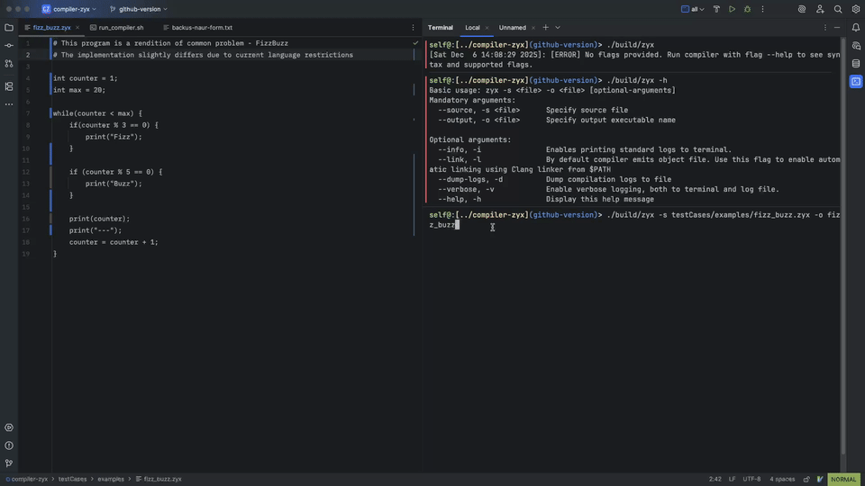
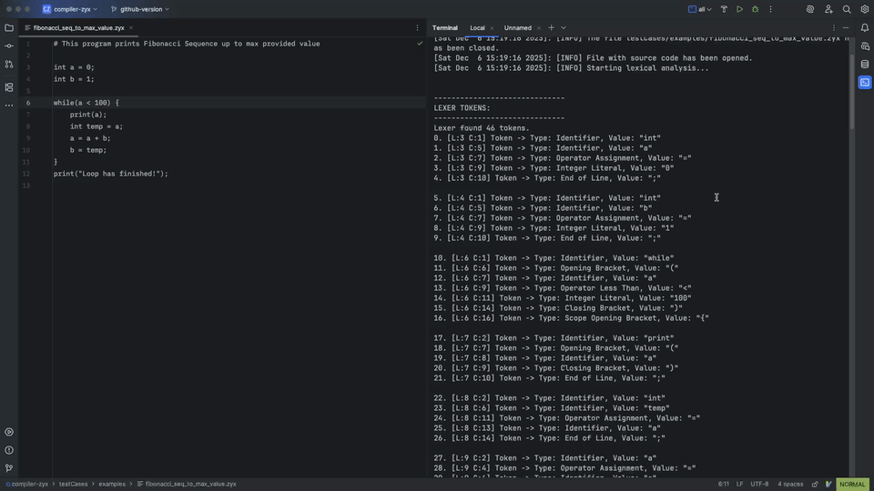
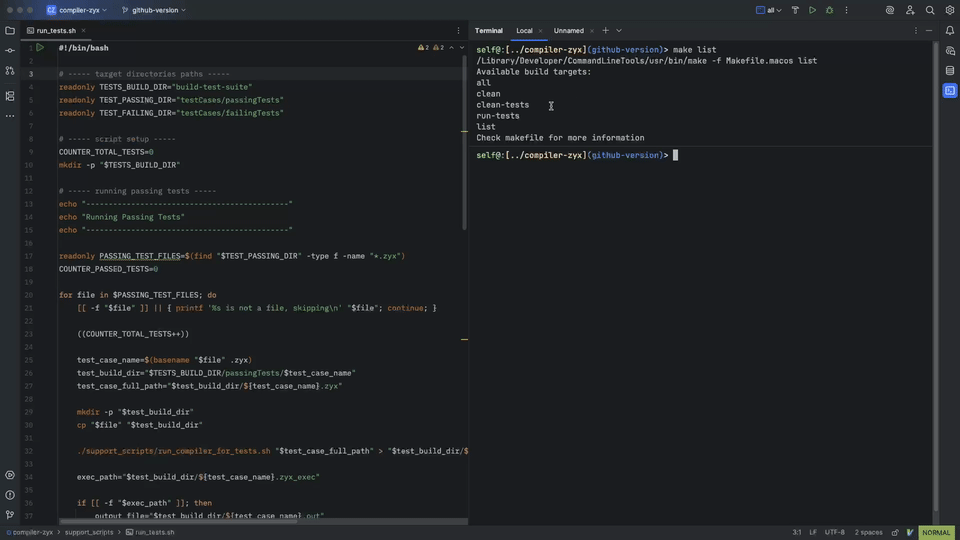
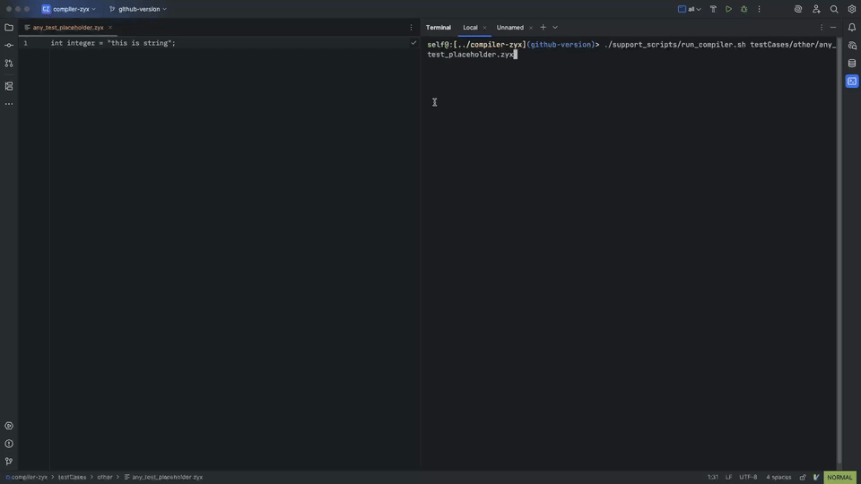

# ABOUT THE PROJECT

This repo contains the source code for a custom compiler project codenamed `Zyx`.  

This is a simple (for now at least) compiler for a custom imperative formal language that draw inspirations syntax-wise from mix of modern C++ and Python. 
The primary purpose was for the language to be Turing-complete with minimal set of primitives. Supported features can be viewed in Backus-Naur form in `./backus-naur-form.txt`.

The core of the compiler is written in C++20, while the backend uses LLVM 19.x, so with provision of those dependencies the project should compile fairly easily - see `Makefile` for details.

## USAGE
Once the project builds execute the binary `./build/zyx` with no arguments. This will provide message explaining usage syntax.
Exemplary usage has been showcased on the videos below.

## EXAMPLES
### Compilation and Running of FizzBuzz(like)
  
**[Click for full video](docs/assets/usage-demos/fizz_buzz.mp4)**

### Fibonacci Sequence with Detailed Compilation Log
  
**[Click for full video](docs/assets/usage-demos/fibonacci.mp4)**

### Running Compiler Test Suite
  
**[Click for full video](docs/assets/usage-demos/run-tests.mp4)**

### Examples of Compiler Catching Errors
  
**[Click for full video](docs/assets/usage-demos/error-example.mp4)**

## LICENSING
**GNU AGPL 3**  
For details please check out the license file `./LICENSE`.
